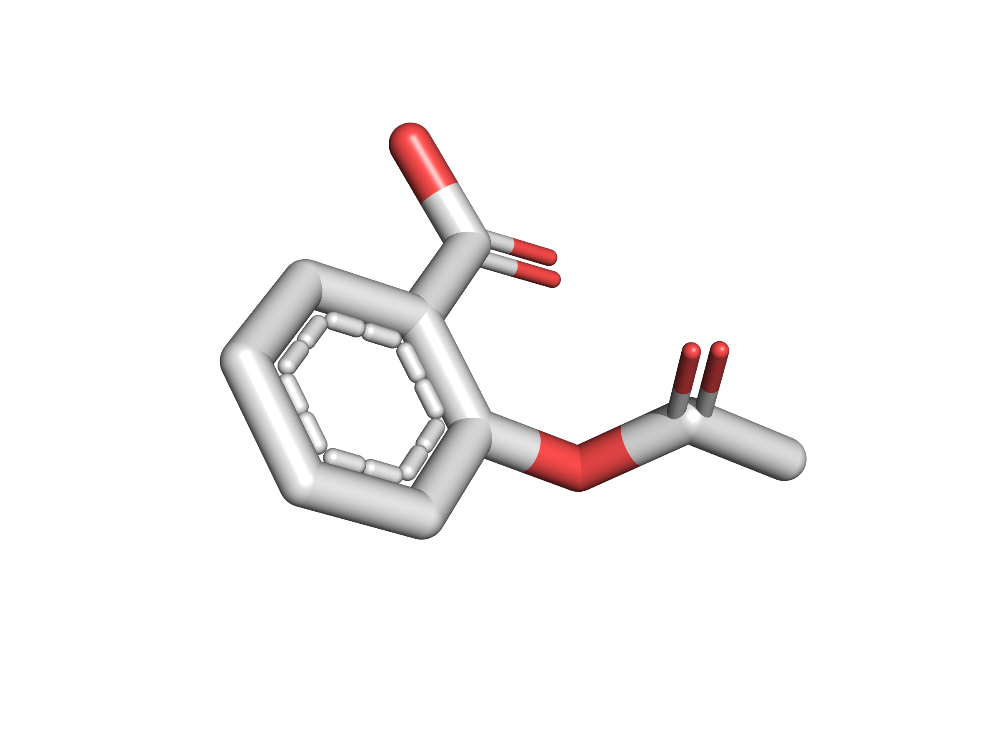

# RDKit Conformer Generator

The code is a tiny CLI RDKit wrapper that: (1) builds multiple conformers, (2) aligns them, (3) selects the conformer whose atomic coordinates are closest to the mean (the “median” conformer), and (4) writes that to `*.pdb`. I use this script to generate structures for high‑quality rendering in PyMol and create publication-ready images. Like here: 



---

## Requirements
- Python 3.12
- [RDKit](https://www.rdkit.org/)

## Installation / Getting Started

**Clone the repo:**

```bash
git clone https://github.com/markusorsi/confgen.git
cd confgen
```

**Create virtual environment (venv recommended):**

```bash
python3.12 -m venv .venv
source .venv/bin/activate
pip install -r requirements.txt
```

And you're ready to go!

---

## Command‑line Usage
```text
python confgen.py -i <SMILES> -o <output_basename> [--nconfs N] [--maxiters M] [--verbose]
```

**Arguments**
- `-i, --input` *(required)*: SMILES string to generate conformers from.
- `-o, --output` *(required)*: Output basename (script appends `.pdb`).
- `--nconfs` *(default 10)*: Number of conformers to generate.
- `--maxiters` *(default 500)*: Maximum MMFF optimization iterations per conformer.
- `--verbose`: Print details about conformer minimization.

**Example**
```bash
# Aspirin
python confgen.py -i "CC(=O)OC1=CC=CC=C1C(=O)O" -o aspirin --nconfs 50 --verbose
```
Output:
```
Mean conformer saved to outputs/aspirin.pdb
```

---

## How it works
1. **Parse & hydrogenate** the input SMILES (`Chem.MolFromSmiles` + `AddHs`).
2. **Generate multiple conformers** with `EmbedMultipleConfs` (reproducible seed, chirality enforced, knowledge‑based torsions enabled).
3. **Optimize** each conformer using MMFF (`MMFFOptimizeMolecule`).
4. **Align** conformers for analysis/visualization.
5. **Compute the median conformer**: find the conformer with minimal squared distance to the mean atomic coordinates across all conformers.
6. **Export** that conformer to PDB (`Chem.MolToPDBFile`).

---

## Rendering tips
- **PyMOL:**
  ```pml
  load aspirin.pdb
  hide everything
  show sticks
  hide (hydro) # Optional hide hydrogens
  util.cbaw # Colors by atom type 
  ray 2400,1800
  png aspirin.png
  ```
---

The resulting image will resemble the one shown at the beginning of the README.

## Python API
If you’d like to call the functions directly because you need a quick conformer generator in one of your project pipelines:

```python
from conformers import ConformersFromSmiles, ComputeMedianConformer
from rdkit import Chem

mol = ConformersFromSmiles('CC(=O)OC1=CC=CC=C1C(=O)O', nConfs=50, maxIters=1000)
median = ComputeMedianConformer(mol)
Chem.MolToPDBFile(median, 'aspirin.pdb')
```

---

## Notes & Caveats
- The “median” here is the conformer closest to the mean coordinate set; it is a *representative* conformer, not necessarily the global minimum.
- Reproducibility is controlled via `randomSeed=42` in `EmbedMultipleConfs`.

> **Tip:** If you plan to add an aligned multi‑model PDB export (for comparing conformers), your helper `ConfsToAlignedMolsList` already has most of the pieces.

---

## License
MIT License 

---

## Acknowledgments
The phenomenal open‑source cheminformatics toolkit RDKit.

---
